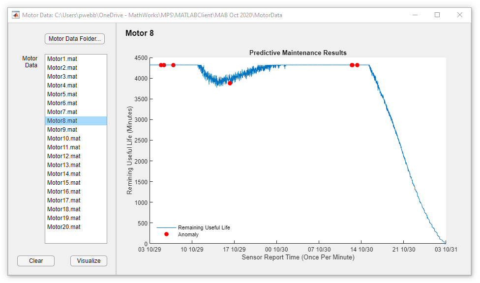

# Motor Health App for "Centralize, Protect and Scale" News and Notes article

Source code for MotorHealth app used in the News and Notes article: "Centralize, Protect, and Scale Your Algorithms for Enterprise Deployment". The application demonstrates how to connect your MATLAB© desktop to an algorithm deployed on MATLAB Production Server.

<!--- If your project includes a visualation or any images or an App please include a screenshot in this README --->

<!--- Markdown supports the following HTML entities: © - &copy;  ® - &reg;  ™ - &trade;
More information about Trademarks can be found internally within the Checklist for Community Contributions and Supportfiles Confluence page--->

## Setup 
To Run:
1. Install MATLAB Client for MATLAB Production Server™
2. Build MotorAnalytics.ctf
3. Deploy MotorAnalytics.ctf to an instance of MATLAB® Production Server
4. Connect MATLAB desktop to MotorAnalytics: prodserver.addon.install('MotorAnalytics', 'localhost', 9910)
5. Run MotorHealth app from Client folder.
6. Select the Data folder as the Motor Data Folder. 
7. Click on Motor8.mat (for example) and then click "Visualize"

See the included ReadMe.txt for additional details on install and setup.

### MathWorks Products (http://www.mathworks.com)

Requires MATLAB release R2020b or newer
- [MATLAB Compiler SDK](https://www.mathworks.com/products/matlab-compiler-sdk.html)
- [MATLAB Production Server](https://www.mathworks.com/products/matlab-production-server.html)
- [MATLAB Client for MATLAB Production Server](https://www.mathworks.com/matlabcentral/fileexchange/73232-matlab-client-for-matlab-production-server)

## License
<!--- Make sure you have a License.txt within your Repo --->
XSLA © 2021 The MathWorks, Inc.

## Community Support
[MATLAB Central](https://www.mathworks.com/matlabcentral)

Copyright 2021 The MathWorks, Inc.

<!--- Do not forget to the add the SECURITY.md to this repo --->
<!--- Add Topics #Topics to your Repo such as #MATLAB  --->

<!--- This is my comment --->

<!-- Include any Trademarks if this is the first time mentioning trademarked products (For Example:  MATLAB&reg; Simulink&reg; Trademark&trade; Simulink Test&#8482;) --> 

